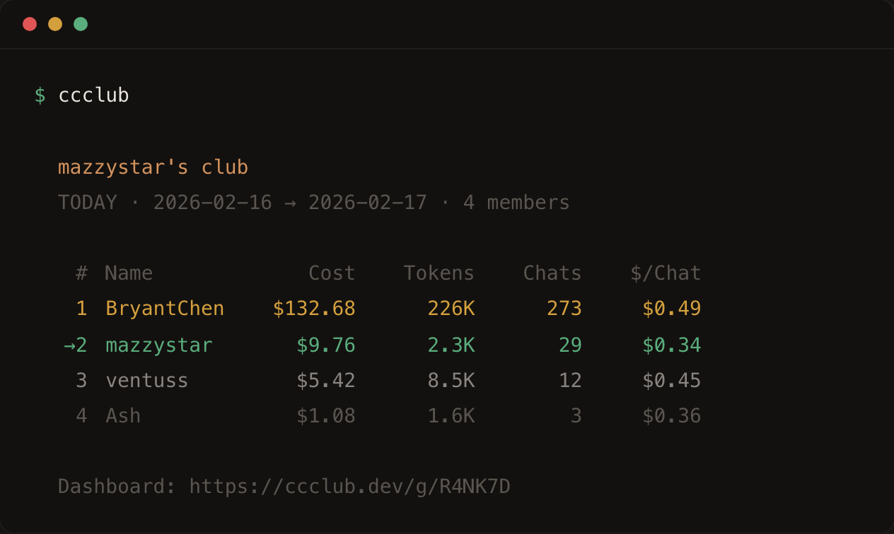

[English](../README.md) | [日本語](./README_JA.md) | [한국어](./README_KO.md) | [Deutsch](./README_DE.md) | [Français](./README_FR.md) | [Español](./README_ES.md)

# AtoLogs

> Fork 自 [mazzzystar/ccclub](https://github.com/mazzzystar/ccclub)（MIT 协议）· 为 atologs.com 定制，加入了留言审核、管理员鉴权、品牌定制等扩展功能。

Claude Code 好友排行榜。



## 开始

```bash
npx ccclub init
```

输入你的名字，拿到一个 6 位邀请码。发给朋友：

```bash
npx ccclub join YHAW6P
```

完事。用量通过 Claude Code hook 自动同步，不用配置，不用注册，不用建号。

朋友加入后，查看排行榜：

```bash
ccclub
```

## 上传了什么

AtoLogs 读取 Claude Code 在本地写入的使用日志 (`~/.claude/projects/`)，打包成每 30 分钟的摘要（token 数 + 费用），只上传这些数字。**不含提示词、不含代码、不含文件路径、不含项目名** — 只有计数器。运行 `ccclub show-data` 可以审查上传内容。

## 命令

日常用这四个就够了：

```bash
ccclub init                        # 一次性初始化，创建小组
ccclub join <邀请码>                # 加入朋友的小组
ccclub sync                        # 手动同步（会话结束也会自动跑）
ccclub                             # 看排行榜
```

更多选项：

```bash
ccclub -d 1                        # 时间窗口：1 / 7 / 30 / all
ccclub --all                       # 显示所有成员（包括今天没有使用记录的）
ccclub --global                    # 所有公开用户
ccclub -g YHAW6P                   # 指定小组
```

想折腾的话，这些也有：

```bash
ccclub create                      # 再建一个小组
ccclub profile                     # 看个人资料
ccclub profile --name "新名字"      # 改显示名
ccclub profile --avatar "URL"      # 自定义头像
ccclub profile --public            # 出现在全球榜
ccclub profile --private           # 从全球榜隐藏（默认）
ccclub show-data                   # 看具体上传了什么
```

## 网页看板

每个小组有一个实时页面：

```
https://atologs.com/g/YHAW6P
```

可切换 today/7d/30d/all time，有头像，每 5 分钟自动刷新。公开用户的全球页面在 `/g/global`。

## 隐私

**只上传**这些：

```json
{
  "blockStart": "2025-02-13T00:00:00Z",
  "blockEnd": "2025-02-13T00:30:00Z",
  "inputTokens": 48210,
  "outputTokens": 12050,
  "cacheCreationTokens": 0,
  "cacheReadTokens": 31200,
  "totalTokens": 91460,
  "costUSD": 0.2184,
  "models": ["claude-sonnet-4-5-20250929"],
  "entryCount": 23
}
```

**默认隐私** — 你只出现在自己加入的小组里。全球榜需要主动开启（`ccclub profile --public`）。

## 架构

```
packages/
  shared/     类型 + 常量
  cli/        ccclub — Commander.js CLI
  worker/     Cloudflare Worker — Hono API + KV + 看板
```

自动同步：Claude Code `SessionEnd` + `Stop` 钩子执行 `ccclub sync --silent`（每 5 分钟限频一次）。

## 开发

```bash
pnpm install
pnpm build
pnpm dev:worker                    # localhost:8787

# 另开终端
CCCLUB_API_URL=http://localhost:8787 ccclub init
```

## 许可证

MIT
